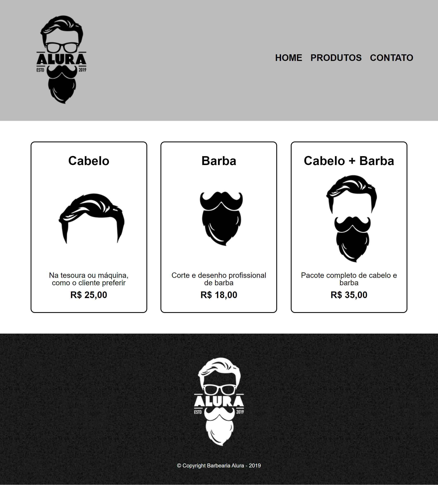
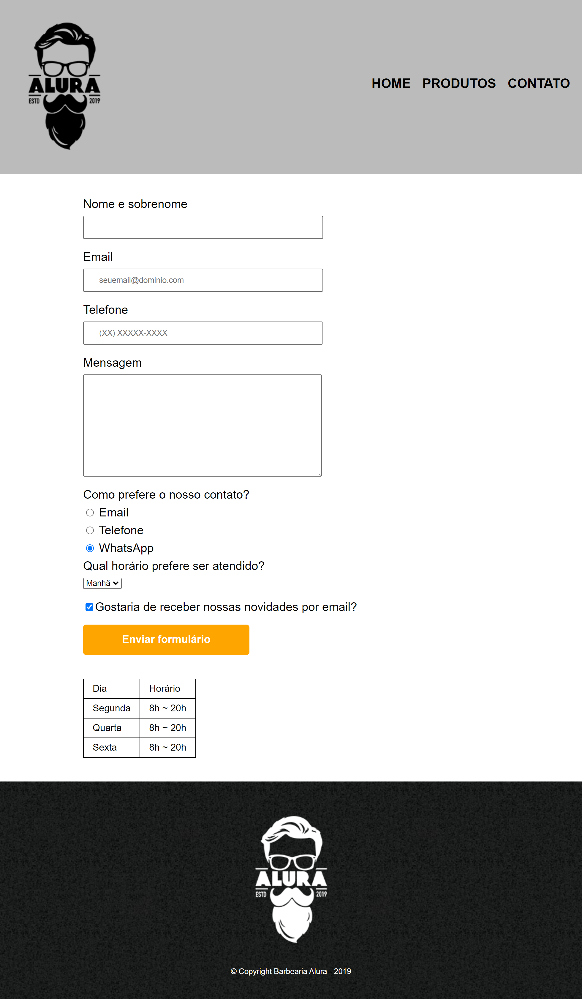

# Barbearia Alura 

> Curso de CSS5 e HTML3

Projeto construído a partir do curso de HTML5 e CSS3 da Alura, instruída pelo professor: Pedro Marins.

🔗[Clique aqui para acessar](https://brunasantos-dev.github.io/barberaria-alura/)

## Tecnologias

- HTML5
- CSS3

## 💜 Contato

s_bruna@live.com 